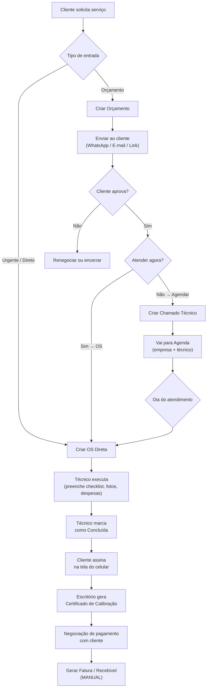
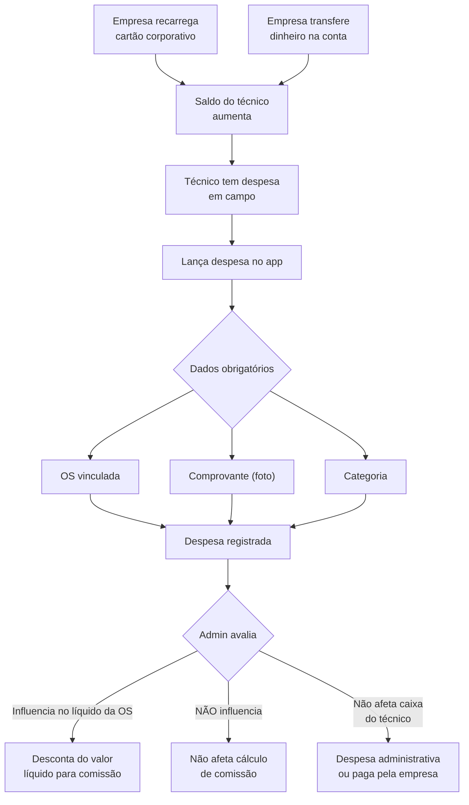

# 📋 Documento de Alinhamento — Sistema OS (Kalibrium)

> Documento consolidado a partir de 4 rodadas de brainstorm (12–13/02/2026).
> Esta é a "bíblia" do sistema — referência para todas as decisões de implementação.

> [!CAUTION]
> **REGRA MÁXIMA: TUDO deve ser controlado por perfis e autorizações granulares. NADA hardcoded.**
> Toda funcionalidade, visibilidade e ação deve ser configurável via permissões.
> Nenhuma regra de negócio pode ser fixa no código — deve ser editável pelo admin.

---

## 1. A Empresa

| Item | Detalhe |
|------|---------|
| **Segmento** | Calibração de balanças (rodoviárias e industriais) |
| **Região** | Brasil inteiro — 97% Mato Grosso, 2% Mato Grosso do Sul, 1% outros |
| **Empresas** | 3 CNPJs distintos, mesma equipe operacional e administrativa |
| **Diferencial** | As 3 empresas fazem os mesmos serviços, não há separação de especialidade |
| **Sistema atual** | **Auvo** (orçamentos, OS, NF) — será substituído pelo Kalibrium |

### Empresas (CNPJs) — Cadastro Manual

| Razão Social | Nome Fantasia | Observação |
|---|---|---|
| Balanças Solution Ltda | Balanças Solution | — |
| Solution Automação e Pesagem Ltda | Balanças Solution | Mesmo nome fantasia |
| Kalibrium Balanças | Kalibrium Balanças | — |

> **IMPORTANTE:** Cada empresa deve ser cadastrada manualmente com suas configurações individuais. Não pré-popular via seeder.

### Equipe — Perfis Genéricos

| Papel | Usa diariamente | Dispositivo principal | Acesso |
|-------|-----------------|----------------------|--------|
| **Super Admin** | ✅ | Desktop | Tudo |
| **Gerente** | ✅ | Desktop | Operações + Financeiro + Relatórios |
| **Atendente** | ✅ | Desktop | Clientes, OS, recebíveis |
| **Vendedor** | ✅ | Desktop + Mobile | Clientes, orçamentos, comissões |
| **Técnico** | ✅ | **Mobile (offline-first)** | Apenas suas OS, despesas, comissão (só valor) |
| **Motorista** | ✅ | Mobile | Suas OS, despesas, abastecimento |
| **Financeiro** | ✅ | Desktop | Todo financeiro, comissões |
| **Técnico-Vendedor** | ✅ | Mobile + Desktop | Acumula ambos os perfis com acesso a valores |

> **IMPORTANTE:** Um mesmo usuário pode ter **múltiplos perfis** (ex: técnico + vendedor). O acesso é a **união** das permissões.

### Equipe Real (referência para configuração)

| Nome | Função | Role | Região / Detalhe |
|------|--------|------|------------------|
| **Roldão** | Proprietário, aprova tudo | `super_admin` | Recebe 70% dos contatos de clientes |
| **Alessandra** | Assistente admin + financeiro (faz tudo) | `admin` ou role amplo | Faz orçamentos, confere despesas, negocia pagamento |
| **Nayara** | Financeira responsável | `financeiro` | NF, boletos, fechamento de comissão |
| **Rodolfo** | Técnico-vendedor (carro próprio) | `tecnico_vendedor` | Campo Novo do Parecis (200km) + Juína. R$ 1,00/km |
| **Weberson** | Técnico-vendedor (carro próprio) | `tecnico_vendedor` | Nova Mutum (200km) + Sinop. R$ 1,00/km ou R$ 1,80/km |
| **Hugo** | Técnico | `tecnico` | Campo Grande / Rondonópolis |
| **Técnicos 4–6** | Técnicos | `tecnico` | A cadastrar manualmente no sistema |
| **Marcelo** | Motorista UMC | `motorista` | Caminhão com pesos padrão (22×500kg = 11t) |

> **Captação de clientes:** 70% Roldão (WhatsApp/ligação) → 5% Alessandra (e-mail) → 25% Rodolfo/Weberson (clientes próprios)

---

## 2. Fluxo Principal de Negócio



### Regras do Fluxo

| Regra | Detalhe |
|-------|---------|
| **Orçamento → OS** | Quando o cliente aprova e será atendido imediatamente |
| **Orçamento → Chamado** | Quando o cliente aprova mas o atendimento será agendado |
| **OS Direta** | Cliente liga e pede atendimento imediato, sem orçamento |
| **Faturamento** | Sempre MANUAL após negociação — **nunca automático** |
| **Alerta crítico** | OS concluída sem faturamento → notificação persistente |
| **Orçamento tem validade** | Configurável (ex: 30 dias). Alertar quando próximo do vencimento |
| **Autorização de deslocamento** | Técnico só inicia deslocamento após autorização do admin no sistema |

### Fluxo de Aprovação Interna do Orçamento

```
Alessandra cria orçamento → Status: "Aguardando Aprovação Interna"
    ↓
Roldão revisa (preços, região, cliente) → Aprova ou solicita correção
    ↓
Status: "Aprovado Internamente"
    ↓
Técnico/vendedor envia ao cliente → Status: "Enviado"
    ↓
Cliente aprova → Status: "Aprovado"
```

> **IMPORTANTE:** Nenhum orçamento pode ser enviado ao cliente sem aprovação interna do admin.

### Fluxo Pós-Execução (Faturamento)

```
OS concluída → Alessandra negocia pagamento com cliente
    ↓
Define condição (à vista, 20/40 boleto, negociável)
    ↓
Nayara emite NF + boleto
    ↓
Acompanha recebimento → Comissões liberadas proporcionalmente
```

---

## 3. Orçamento — Detalhamento

### Estrutura do Orçamento

```
Orçamento
├── Cliente (obrigatório)
├── Empresa/Tenant (obrigatório — qual CNPJ)
├── Validade (data)
├── Equipamento 1 (vinculado ao cliente)
│   ├── Serviço A (com preço)
│   ├── Serviço B (com preço)
│   ├── Produto X (com preço + foto miniatura se cadastrada)
│   └── Produto Y (com preço + foto miniatura se cadastrada)
├── Equipamento 2 (vinculado ao cliente)
│   ├── Serviço C
│   └── Produto Z
├── Fotos anexadas (galeria celular ou computador)
├── Deslocamento (por km rodado — pode cobrar ou não)
├── Campo "Origem" (prospecção, retorno, contato_direto, indicação)
└── Observações / Condições comerciais
```

> **Deslocamento:** Cobrado por km rodado. Valor configurável.
> **Campo Origem:** Necessário para diferenciar comissão de vendedor (prospecção = % maior, retorno = % menor).
> **Desconto:** Todo desconto passa pelo admin — sem autonomia para dar desconto.

### Regras de Precificação

| Critério | Detalhe |
|----------|---------|
| **Por região** | Preço diferente por localidade |
| **Por cliente** | Preço especial para clientes recorrentes |
| **Por tipo de cliente** | Governo, indústria, comércio, etc. |
| **Histórico inteligente** | Ao lançar item para um cliente, mostrar últimos preços praticados para ele |

### Aprovação pelo Cliente

| Canal | Como funciona |
|-------|--------------|
| **Link público** | E-mail/WhatsApp com link e botão "Aprovar" |
| **WhatsApp** | Cliente confirma por mensagem |
| **Ligação** | Atendente marca como aprovado no sistema |
| **E-mail** | Cliente responde confirmando |

---

## 4. Contratos Recorrentes

| Tipo | Comportamento |
|------|--------------|
| **On-demand** | Cliente chama quando precisa, sem periodicidade |
| **Programado** | Datas fixas (ex: mensal, trimestral, semestral) |

### Alertas de Contrato

- **1 semana antes** da data programada → Notificação para abrir chamado técnico
- Canais: sistema + WhatsApp + push mobile

---

## 5. Técnico — Experiência Mobile Offline (REQUISITO CRÍTICO)

### Cenário Real

> O técnico está numa fazenda calibrando uma balança rodoviária, **sem internet**.
> Ele precisa trabalhar normalmente e sincronizar quando tiver sinal.

### Funcionalidades Offline Obrigatórias

| Função | Offline? | Detalhe |
|--------|----------|---------|
| Ver OS e dados dos equipamentos | ✅ | Dados sincronizados automaticamente |
| Preencher checklist por equipamento | ✅ | Cada balança tem seu próprio checklist |
| Tirar fotos do serviço | ✅ | Salvar localmente, enviar depois |
| Lançar despesas (com comprovante) | ✅ | Foto do comprovante + OS vinculada |
| Marcar OS como concluída | ✅ | Sincroniza status quando online |
| Colher assinatura do cliente | ✅ | Na tela do celular |
| Selecionar pesos padrão usados | ✅ | Lista pré-carregada |

### Sincronização

| Estratégia | Detalhe |
|-----------|---------|
| **Auto-sync** | Quando novos dados relevantes surgem para o técnico (ex: nova OS atribuída) |
| **Background sync** | Quando o celular detecta conexão, envia dados pendentes |
| **Conflict resolution** | Se o escritório editou algo enquanto o técnico estava offline |

### Restrições de Acesso do Técnico

| O técnico VÊ | O técnico NÃO VÊ |
|--------------|------------------|
| Suas OS atribuídas | OS de outros técnicos |
| Seus apontamentos de hora | Financeiro geral |
| Suas despesas | Despesas de outros |
| Valor da sua comissão (apenas valor final) | Preços de produtos/serviços |
| Seus equipamentos/checklists | Dados de faturamento |
| Adicionar itens na OS (sem ver preço) | Comissões de outros técnicos |

> **CUIDADO:** Técnico puro NUNCA vê valores de produtos ou serviços, mas PODE adicionar itens na OS.
> Exceção: Técnico-Vendedor (Rodolfo, Weberson) VÊ os valores.
> Cada técnico só vê suas próprias coisas — NUNCA as de outro técnico.

### Matriz de Visibilidade Completa

| Funcionalidade | Super Admin | Admin/Assistente | Financeiro | Téc.-Vendedor | Técnico Puro | Motorista |
|---|:---:|:---:|:---:|:---:|:---:|:---:|
| Todas as OS | ✅ | ✅ | ❌ | ❌ só suas | ❌ só suas | ❌ só suas |
| Preços serviços/produtos | ✅ | ✅ | ✅ | ✅ | ❌ | ❌ |
| Adicionar itens na OS | ✅ | ✅ | ❌ | ✅ | ✅ (sem preço) | ❌ |
| Financeiro completo | ✅ | ✅ | ✅ | ❌ | ❌ | ❌ |
| Comissões (geral) | ✅ | ✅ | ✅ | ❌ só dele | ❌ só dele | ❌ só dele |
| Despesas (todas) | ✅ | ✅ (confere) | ✅ | ❌ só dele | ❌ só dele | ❌ só dele |
| Aprovar orçamento | ✅ | ❌ | ❌ | ❌ | ❌ | ❌ |
| Aprovar despesas | ✅ | ❌ (confere) | ❌ | ❌ | ❌ | ❌ |
| Aprovar comissão | ✅ | ❌ | ❌ (faz fechamento) | ❌ | ❌ | ❌ |
| Emitir NF/boleto | ✅ | ✅ | ✅ | ❌ | ❌ | ❌ |
| App mobile (campo) | ❌ | ❌ | ❌ | ✅ | ✅ | ✅ |
| Lançar despesas | ✅ | ✅ | ✅ | ✅ | ✅ | ✅ |
| Controle abastecimento | ✅ | ✅ | ✅ | ❌ | ❌ | ✅ |

### Plataforma Mobile

- **Dispositivo principal:** Android
- **Abordagem:** PWA (Progressive Web App) com Service Workers

### Carga de Trabalho

- **1 a 3 OS por dia** por técnico
- Atendimento pode durar de 30 min a dia inteiro (balança rodoviária = operação longa)

---

## 6. Motorista / UMC (Unidade Móvel de Calibração)

| Item | Detalhe |
|------|---------|
| **Motorista atual** | Marcelo |
| **Veículo** | Caminhão UMC com pesos padrão (22×500kg = 11t) e guindauto |
| **Função** | Conduz o caminhão + opera guindauto para posicionar pesos na balança |
| **Acompanha** | O técnico, que vai em carro de assistência separado |
| **Quando vai** | Calibração rodoviária (obrigatório) ou como auxiliar quando não tem serviço |
| **No sistema** | Vinculado às mesmas OS do técnico |
| **App mobile** | ✅ Obrigatório — lança despesas e controle de abastecimento |

### Controle de Abastecimento (Motorista)

| Campo | Obrigatório | Detalhe |
|-------|:-----------:|--------|
| Km rodados | ✅ | Odômetro do veículo |
| Placa do veículo | ✅ | Selecionável |
| Localização do posto | ✅ | Mapa com geolocalização |
| Posto | ✅ | Cadastrado ou cadastrar na hora (prático, pelo próprio motorista) |
| Litros | ✅ | Quantidade abastecida |
| Valor | ✅ | Valor total |

---

## 7. Caixa do Técnico — Fluxo Completo



### Regras de Despesa

| Regra | Detalhe |
|-------|---------|
| **Toda despesa MUST ter OS vinculada** | Obrigatório |
| **Comprovante obrigatório** | Foto do recibo/nota |
| **Toggle "Influencia no líquido da OS"** | Admin pode marcar/desmarcar. Mesmo tipo de despesa pode influenciar em um cenário e não em outro |
| **Toggle "Afeta caixa do técnico"** | Despesas administrativas ou pagas diretamente pela empresa NÃO afetam o caixa |
| **Múltiplos técnicos por OS** | Cada um lança suas despesas separadamente na mesma OS |
| **Saldo gerenciado no sistema** | Cartão corporativo + dinheiro transferido = saldo total, sistema mostra entradas/saídas/restante |

### Fontes de Pagamento

| Fonte | Funcionamento |
|-------|-------------- |
| **Cartão corporativo** | Saldo pré-carregado, técnico presta conta |
| **Dinheiro na conta** | Empresa transfere, técnico presta conta |
| **Dinheiro próprio** | Técnico paga e empresa reembolsa |

### Km Rodados (Técnicos com carro próprio)

| Técnico | Valor/km | Condição |
|---------|----------|----------|
| **Rodolfo** | R$ 1,00/km | Todo deslocamento |
| **Weberson** | R$ 1,00/km | Deslocamento NÃO cobrado do cliente |
| **Weberson** | R$ 1,80/km | Deslocamento cobrado do cliente |

> O km rodado é lançado como despesa na OS, informando quantidade de km e valor.

### Fluxo de Aprovação de Despesas

```
Técnico/motorista lança despesa no app (com comprovante)
    ↓
Alessandra confere os dados
    ↓
Roldão aprova
```

### Tipos de Despesa Comuns

- Combustível
- Alimentação
- Hospedagem
- Pedágio
- Km rodados (técnicos com carro próprio)

---

## 8. Comissões — Regras Complexas

### Regra Geral

| Regra | Detalhe |
|-------|---------|
| **Quando paga** | Somente APÓS recebimento do cliente |
| **Se parcelado** | Só entra a parcela paga no mês do fechamento |
| **Fechamento** | Mensal — Nayara (financeiro) faz, Roldão (admin) aprova |
| **Contestações** | Frequentes — relatórios devem ser detalhados OS por OS com cálculo explícito |
| **Metas** | Existem metas configuráveis para vendedores e técnicos |

### Bases de Cálculo (configurável por regra)

| Base | Exemplo |
|------|---------|
| % do valor **bruto** da OS | 10% de R$ 5.000 = R$ 500 |
| % do valor **líquido** da OS | 10% de (R$ 5.000 - R$ 800 despesas) = R$ 420 |
| % do bruto **menos itens específicos** | 10% de (R$ 5.000 - R$ 300 item X) = R$ 470 |
| **Valor fixo por OS** | R$ X por OS executada (configurável por técnico) |
| Outras regras customizáveis | Combinações diversas |

### Regras por Perfil

| Perfil | Base de Cálculo | Detalhe |
|--------|----------------|--------|
| **Vendedor (fechamento)** | % do bruto dos serviços | % menor — cliente veio por conta própria |
| **Vendedor (prospecção)** | % do bruto dos serviços | % **maior** — vendedor trouxe o cliente |
| **Técnico** | % ou valor fixo por OS | Cada técnico pode ter regras diferentes e múltiplas |
| **Técnico (venda de produto)** | Comissão sobre venda | Ganha comissão em vendas mesmo não sendo vendedor |
| **Técnico-vendedor (mesma OS)** | Só comissão de **técnico** | NÃO acumula vendedor + técnico na mesma OS |
| **Motorista** | Valor fixo por OS | Só quando UMC é usada (calibração rodoviária) |

> **Campo "Origem" no orçamento/OS:** Necessário para diferenciar comissão do vendedor:
>
> - `prospecção` = % maior (vendedor trouxe o cliente)
> - `retorno` / `contato_direto` = % menor

### Divisão entre Múltiplos Técnicos

| Cenário | Regra |
|---------|-------|
| 1 técnico na OS | Ganha 100% da sua comissão |
| 2+ técnicos na OS | Cada um ganha **50%** do que ganharia sozinho |

### Especificidades

| Regra | Detalhe |
|-------|---------|
| **Comissão por técnico** | Cada técnico pode ter regra/percentual diferente |
| **Múltiplos técnicos na OS** | Divisão automática (50% cada) |
| **Despesas afetam o líquido** | Apenas as marcadas como "influencia no líquido" |
| **Técnico vê** | Apenas o **valor final** da sua comissão, nunca os preços dos itens |
| **Regras configuráveis** | Todas as regras devem ser editáveis pelo admin, nunca hardcoded |

---

## 9. Certificado de Calibração — ISO 17025

### Fluxo de Geração

```
Técnico preenche checklist em campo
    ↓
Dados sincronizam com o escritório
    ↓
Escritório revisa os dados
    ↓
Responsável técnico gera o certificado (PDF)
    ↓
Certificado com numeração sequencial por empresa
```

> **Quem emite hoje:** Roldão. **Futuro:** Supervisor da assistência técnica.
> **Assinatura:** Imagem da assinatura (não ICP-Brasil digital).
> **1 OS = N certificados:** Cada equipamento/balança gera certificado separado.

### Estrutura Real do Certificado (analisado do PDF existente)

**Página 1 — Dados e Rastreabilidade:**

| Seção | Campos |
|-------|--------|
| **1. Dados do Cliente** | Solicitante, CNPJ, endereço, cidade/UF, unidade |
| **2. Dados do Instrumento** | Fabricante, modelo, tipo, classe de exatidão, nº série, capacidade, divisão, setor, periodicidade da calibração |
| **3. Informações do Procedimento** | Umidade, pressão, temperatura, unidade de massa, tipo calibração (antes/depois ajuste) |
| **4. Rastreabilidade dos Padrões** | Tabela: ID peso, descrição, nº certificado, validade, acreditação |

**Página 2 — Resultados e Assinaturas:**

| Seção | Campos |
|-------|--------|
| **5. Resultados da Calibração** | Tabela: valor referência, indicação crescente/decrescente, erro, incerteza expandida, fator k |
| **6. Declaração de Conformidade** | Maior incerteza vs desvio máximo vs desvio permissível |
| **7. Observações** | Texto livre |
| **8. Legenda** | Abreviações (VN, VR, LP, VML, etc.) |
| **Datas** | Data calibração, data emissão, próxima calibração |
| **Assinatura** | Nome + imagem da assinatura do responsável técnico |

**Anexo 1 — Ensaio de Excentricidade:**
Tabela com posições na plataforma, cargas, indicações e cálculos de erro por posição.

**Padrão de nomenclatura dos arquivos:**
`{série_equipamento} - {número_certificado}-BL_{ano}.pdf`

**Organização:** `Cliente / Ano / OS {número} / arquivos`

### Requisitos do Certificado

| Campo | Obrigatório | Detalhe |
|-------|-------------|---------|
| Número sequencial | ✅ | Por empresa (CNPJ). Deve haver configuração para definir o ponto de partida da numeração |
| Dados do equipamento | ✅ | Tipo, marca, modelo, série, capacidade, resolução, classe de exatidão, divisão |
| Condições ambientais | ✅ | Temperatura, umidade, pressão |
| Padrões utilizados (pesos) | ✅ | Quais pesos foram usados + número dos certificados dos pesos + validade |
| Incerteza de medição | ✅ | Conforme ISO 17025, com fator k |
| Resultados das medições | ✅ | Valores crescente, decrescente, erro calculado |
| Declaração de conformidade | ✅ | Comparação desvio máximo vs permissível |
| Ensaio de excentricidade | ✅ | Anexo separado com posições na plataforma |
| Rastreabilidade | ✅ | Cadeia de rastreabilidade dos padrões |
| Responsável técnico | ✅ | Nome + imagem da assinatura |
| Assinatura do cliente | ✅ | Colhida digitalmente em campo |

### Pesos Padrão (Não são "Equipamentos")

| Item | Detalhe |
|------|---------|
| **O que são** | Massas de referência (pesos) usados na calibração das balanças |
| **NÃO são equipamentos** do sistema | São cadastro/entidade separada |
| **Têm certificado próprio** | Com validade controlada |
| **Técnico seleciona na OS** | Quais pesos usou naquela calibração |
| **Referência cruzada** | Certificado da balança referencia os certificados dos pesos |
| **Controle de validade** | Alerta quando certificado do peso está vencendo |

> **ATENÇÃO:** O checklist é **pré-requisito** para gerar o certificado. Sem checklist preenchido = sem certificado.
> **Templates existentes:** Pasta `Nova pasta` na raiz do projeto com certificados reais organizados por cliente/ano/OS.

---

## 10. Multi-Tenant

| Aspecto | Comportamento |
|---------|--------------|
| **3 tenants** | 3 empresas com CNPJs distintos (cadastro manual) |
| **Mesma equipe** | Técnicos e admin são os mesmos nas 3 |
| **OS por empresa** | A OS já é criada dentro da empresa correta |
| **Trocar empresa** | Usuário alterna entre tenants no sistema |
| **Sem filiais** | Não usam o conceito de filiais |
| **Técnicos por região** | Técnicos são organizados por região do estado |
| **Caixa financeiro** | Consolidado — visão única das 3 empresas com filtro por CNPJ |
| **Contas bancárias** | Separadas por empresa |

---

## 11. Alertas e Notificações (Prioridade)

| # | Alerta | Prioridade | Canais |
|---|--------|-----------|--------|
| 1 | OS concluída sem faturamento | 🔴 CRÍTICO | Sistema + WhatsApp + Push |
| 2 | Contrato recorrente com data se aproximando (1 semana) | 🔴 CRÍTICO | Sistema + WhatsApp + Push |
| 3 | Equipamento com calibração vencendo | 🟡 ALTO | Sistema + WhatsApp |
| 4 | Técnico com despesa pendente de prestação de conta | 🟡 ALTO | Sistema + Push |
| 5 | SLA estourado | 🟠 ALTO | Sistema + Push |
| 6 | Certificado de peso padrão vencendo | 🟡 ALTO | Sistema |
| 7 | Orçamento próximo da validade | 🟡 MÉDIO | Sistema |

---

## 12. Integrações Necessárias

### 12.1 Emissor de NF-e / NFS-e

> **Recomendação:** [Nuvemfiscal](https://nuvemfiscal.com.br/) ou [Focus NFe](https://focusnfe.com.br/)
>
> Ambos oferecem API REST moderna para emissão de NF-e (produto), NFS-e (serviço), NFC-e.
>
> **Alternativa mais simples**: [eNotas](https://enotas.com.br/)

### 12.2 WhatsApp Business API

> **Recomendação:** [Evolution API](https://evolution-api.com/) (open-source, self-hosted)
> ou [Z-API](https://www.z-api.io/) (SaaS brasileiro, simples, barato).
>
> Para algo mais profissional/oficial: [Twilio](https://www.twilio.com/whatsapp) ou [Meta Cloud API](https://developers.facebook.com/docs/whatsapp/cloud-api) direta.

### 12.3 Integração Bancária

| Banco | Uso | Integração |
|-------|-----|-----------|
| Santander | Principal | Open Banking / API Santander |
| Inter | Operações | API do Banco Inter (bem documentada) |
| Caixa | Operações | CNAB 240/400 |
| Nubank | Operações | API limitada — provavelmente OFX/CSV import |

### 12.4 Migração de Dados — Auvo API v2

> **URL da API:** `https://api.auvo.com.br/v2`
> **Documentação:** [https://auvoapiv2.docs.apiary.io/](https://auvoapiv2.docs.apiary.io/)
> **Autenticação:** APP KEY + TOKEN (já configurados na conta Auvo)

**Recursos disponíveis para importação:**

| # | Recurso Auvo | Entidade Kalibrium | Prioridade |
|---|-------------|-------------------|-----------|
| 1 | Customers | `Customer` | 🔴 Alta |
| 2 | Equipments | `Equipment` | 🔴 Alta |
| 3 | Equipment categories | `ProductCategory` / tipo | 🟡 Média |
| 4 | Tasks (OS) | `WorkOrder` | 🔴 Alta |
| 5 | Task types | Tipos de OS | 🟡 Média |
| 6 | Tickets | Chamados | 🟡 Média |
| 7 | Quotations | Orçamentos | 🟡 Média |
| 8 | Expenses | `Expense` | 🟡 Média |
| 9 | Expense types | `ExpenseCategory` | 🟢 Baixa |
| 10 | Products | `Product` | 🟡 Média |
| 11 | Product categories | `ProductCategory` | 🟢 Baixa |
| 12 | Services | Serviços | 🟡 Média |
| 13 | Users | Técnicos/Usuários | 🟡 Média |
| 14 | Teams | Equipes | 🟢 Baixa |
| 15 | Customer groups | Grupos de clientes | 🟢 Baixa |
| 16 | Segments | Segmentos | 🟢 Baixa |
| 17 | Questionnaires | Checklists | 🟡 Média |
| 18 | GPS | Histórico GPS | 🟢 Baixa |
| 19 | Satisfaction surveys | Pesquisas | 🟢 Baixa |
| 20 | Projects | Projetos | 🟢 Baixa |
| 21 | Keywords | Tags | 🟢 Baixa |

---

## 13. Gaps Críticos Identificados (vs. Código Atual)

> Verificados diretamente na base de código em 12–13/02/2026.

| # | Gap | Status Real no Código | Impacto |
|---|-----|----------------------|---------|
| 1 | **PWA Offline para técnicos** | ❌ Nenhum service-worker | 🔴 BLOQUEANTE para produção |
| 2 | **Pesos Padrão (cadastro + certificados)** | ❌ Nenhum model/entidade | 🔴 Necessário para certificados |
| 3 | **Certificado Calibração ISO 17025 (PDF)** | ❌ Nenhum gerador | 🔴 Core do negócio |
| 4 | **Toggles de despesa** (influencia líquido / afeta caixa) | ❌ Colunas inexistentes | 🔴 Afeta cálculo de comissões |
| 5 | **Numeração sequencial de certificado** | ⚠️ A verificar | 🔴 Necessário se já tem sequência |
| 6 | **Integração WhatsApp** | ❌ Nenhuma referência | 🟡 Importante mas não bloqueante |
| 7 | **Push Notifications** | ❌ Nenhum web-push | 🟡 Importante para técnicos |
| 8 | **Integração NF-e/NFS-e** | ✅ Estrutura base existe (drivers NFS-e) | 🟡 Falta ativação/testes |
| 9 | **Integração Bancária** | ⚠️ `BankStatement` model existe | 🟡 Falta import OFX/CNAB |
| 10 | **Histórico inteligente de preços** | ⚠️ `PriceHistory` model existe | 🟡 Falta UI inteligente |
| 11 | **Importação de dados do Auvo** | ❌ Não existe | 🟡 API v2 disponível |
| 12 | **Fluxo aprovação interna de orçamento** | ❌ Não existe | 🔴 Necessário para workflow real |
| 13 | **Autorização de deslocamento** | ❌ Não existe (feito via WhatsApp) | 🔴 Core do fluxo operacional |
| 14 | **Campo "Origem" no orçamento/OS** | ❌ Não existe | 🔴 Afeta cálculo comissão vendedor |
| 15 | **Comissão vinculada a pagamento recebido** | ❌ A verificar | 🔴 Regra fundamental |
| 16 | **Divisor automático comissão (2+ técnicos)** | ❌ A verificar | 🔴 50% cada |
| 17 | **Técnico adiciona itens sem ver preço** | ❌ A verificar | 🟡 Permissão granular |
| 18 | **Controle de abastecimento (motorista)** | ❌ Não existe | 🟡 km, placa, posto, mapa |
| 19 | **Km rodados como despesa** | ❌ Não existe | 🟡 R$ 1,00 e R$ 1,80/km |
| 20 | **Mapa de calor INMETRO** | ❌ Não existe | 🟡 Balanças por cidade |
| 21 | **CRM: lead permanente + próximo contato** | ❌ A verificar | 🟡 Nenhum cliente esquecido |
| 22 | **Caixa financeiro consolidado (3 empresas)** | ❌ A verificar | 🟡 Visão única com filtro |
| 23 | **Metas de vendas** | ⚠️ `CommissionGoal` existe | 🟡 Metas para vendedores e técnicos |

---

## 14. Prioridades de Implementação — Opção A (Cascata por Sprint)

### Sprint 0 — Fundação (Produção-Ready)

> Garantir que todos os módulos existentes estão **100% funcionais** sem bugs.

- [ ] Auditoria e correção de todos os módulos existentes
- [ ] Testes de integração end-to-end
- [ ] Validação de fluxos CRUD completos

### Sprint 1 — Core Business

1. Pesos Padrão (cadastro + certificados + validade)
2. Certificado de Calibração ISO 17025 (PDF completo)
3. Configuração de numeração sequencial por empresa
4. Toggles de despesa (influencia líquido / afeta caixa do técnico)

### Sprint 2 — Mobile Offline

1. PWA com Service Workers
2. Sync automático + manual
3. Visão restrita do técnico
4. Checklist + fotos + assinatura offline

### Sprint 3 — Integrações

1. Emissor NF-e/NFS-e (ativação completa)
2. WhatsApp Business API
3. Push notifications
4. Conciliação bancária (import OFX/CNAB)

### Sprint 4 — Inteligência e Migração

1. Histórico inteligente de preços
2. Import de dados do Auvo (via API v2)
3. Dashboards avançados
4. Relatórios customizados

---

> **Este documento é vivo** — será atualizado conforme novas decisões forem tomadas.
> **Última atualização:** 13/02/2026 (brainstorm rodada 4 com Roldão)
> **Documento complementar:** `alinhamento_brainstorm_v2.md` no diretório do brain
